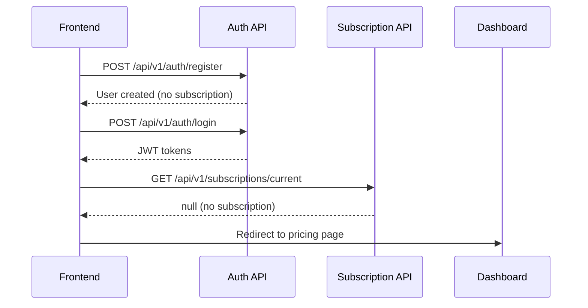
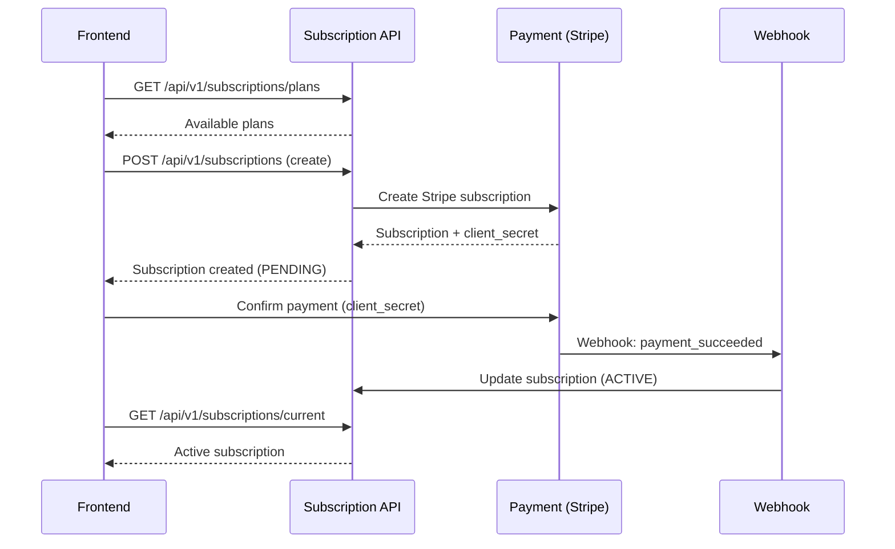
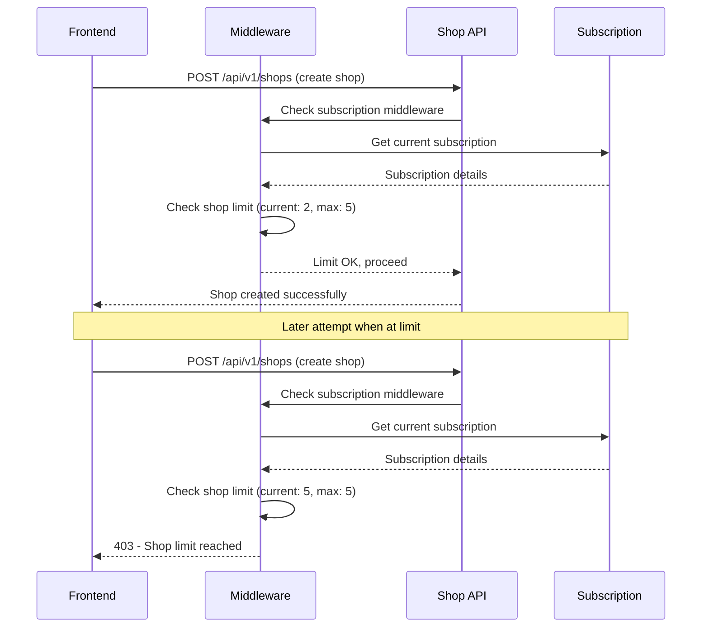
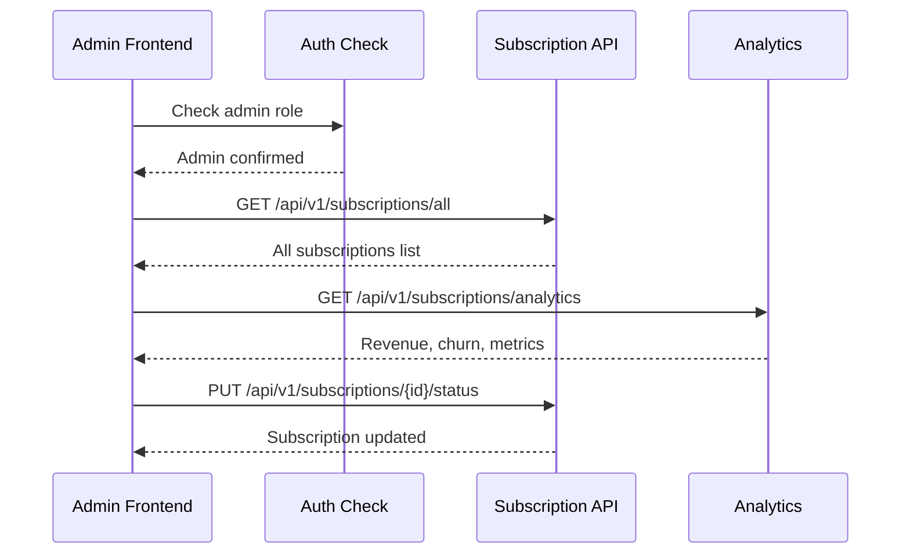

# 🔄 API Flow Examples - Complete Implementation

## 📋 Table of Contents

1. [Authentication Flow](#authentication-flow)
2. [Subscription Creation Flow](#subscription-creation-flow)
3. [Business Operations Flow](#business-operations-flow)
4. [Admin Management Flow](#admin-management-flow)
5. [Error Handling Examples](#error-handling-examples)
6. [Real-world Scenarios](#real-world-scenarios)

---

## 🔐 Authentication Flow

### 1. User Registration → Login → Dashboard Access



#### Implementation Example:

```javascript
// Complete authentication flow
class AuthService {
  async register(userData) {
    const response = await fetch("/api/v1/auth/register", {
      method: "POST",
      headers: { "Content-Type": "application/json" },
      body: JSON.stringify(userData),
    });

    const result = await response.json();

    if (result.success) {
      // Auto-login after registration
      return this.login({
        email: userData.email,
        password: userData.password,
      });
    }

    throw new Error(result.message);
  }

  async login(credentials) {
    const response = await fetch("/api/v1/auth/login", {
      method: "POST",
      headers: { "Content-Type": "application/json" },
      body: JSON.stringify(credentials),
    });

    const result = await response.json();

    if (result.success) {
      // Store tokens
      localStorage.setItem("authToken", result.data.accessToken);
      localStorage.setItem("refreshToken", result.data.refreshToken);

      // Check subscription status
      const subscription = await this.checkSubscription();

      return {
        user: result.data.user,
        subscription: subscription,
        needsSubscription: !subscription,
      };
    }

    throw new Error(result.message);
  }

  async checkSubscription() {
    try {
      const response = await this.apiCall("/api/v1/subscriptions/current");
      return response.data;
    } catch (error) {
      return null;
    }
  }

  async apiCall(url, options = {}) {
    const token = localStorage.getItem("authToken");

    const response = await fetch(url, {
      ...options,
      headers: {
        "Content-Type": "application/json",
        ...(token && { Authorization: `Bearer ${token}` }),
        ...options.headers,
      },
    });

    if (response.status === 401) {
      // Token expired, try refresh
      const refreshed = await this.refreshToken();
      if (refreshed) {
        // Retry original request
        return this.apiCall(url, options);
      } else {
        // Redirect to login
        this.logout();
        throw new Error("Session expired");
      }
    }

    return response.json();
  }

  async refreshToken() {
    const refreshToken = localStorage.getItem("refreshToken");
    if (!refreshToken) return false;

    try {
      const response = await fetch("/api/v1/auth/refresh", {
        method: "POST",
        headers: { "Content-Type": "application/json" },
        body: JSON.stringify({ refreshToken }),
      });

      const result = await response.json();

      if (result.success) {
        localStorage.setItem("authToken", result.data.accessToken);
        return true;
      }
    } catch (error) {
      console.error("Token refresh failed:", error);
    }

    return false;
  }

  logout() {
    localStorage.removeItem("authToken");
    localStorage.removeItem("refreshToken");
    window.location.href = "/login";
  }
}
```

---

## 💳 Subscription Creation Flow

### 2. Plan Selection → Payment → Activation



#### Implementation Example:

```javascript
// Complete subscription flow
class SubscriptionService {
  constructor() {
    this.authService = new AuthService();
  }

  async getPlans() {
    const response = await fetch("/api/v1/subscriptions/plans");
    const result = await response.json();
    return result.data;
  }

  async createSubscription(planId, billingCycle = "monthly") {
    const response = await this.authService.apiCall("/api/v1/subscriptions", {
      method: "POST",
      body: JSON.stringify({
        planId,
        paymentGateway: "STRIPE",
        billingCycle,
      }),
    });

    if (response.success) {
      return {
        subscription: response.data.subscription,
        clientSecret: response.data.clientSecret,
        needsPayment: !!response.data.clientSecret,
      };
    }

    throw new Error(response.message);
  }

  async confirmPayment(clientSecret, paymentMethod) {
    const stripe = await loadStripe(
      process.env.REACT_APP_STRIPE_PUBLISHABLE_KEY
    );

    const { error, paymentIntent } = await stripe.confirmCardPayment(
      clientSecret,
      {
        payment_method: paymentMethod,
      }
    );

    if (error) {
      throw new Error(error.message);
    }

    if (paymentIntent.status === "succeeded") {
      // Wait for webhook to process (or poll for status)
      return this.waitForActivation();
    }

    throw new Error("Payment not completed");
  }

  async waitForActivation(maxAttempts = 10) {
    for (let i = 0; i < maxAttempts; i++) {
      await new Promise((resolve) => setTimeout(resolve, 2000)); // Wait 2 seconds

      const subscription = await this.getCurrentSubscription();
      if (subscription && subscription.status === "ACTIVE") {
        return subscription;
      }
    }

    throw new Error("Subscription activation timeout");
  }

  async getCurrentSubscription() {
    const response = await this.authService.apiCall(
      "/api/v1/subscriptions/current"
    );
    return response.data;
  }

  async getUsage() {
    const response = await this.authService.apiCall(
      "/api/v1/subscriptions/usage"
    );
    return response.data;
  }

  async cancelSubscription(reason) {
    const response = await this.authService.apiCall(
      "/api/v1/subscriptions/cancel",
      {
        method: "POST",
        body: JSON.stringify({ reason }),
      }
    );

    return response.data;
  }
}
```

---

## 🏪 Business Operations Flow

### 3. Shop Creation with Limit Checking



#### Implementation Example:

```javascript
// Business operations with limit handling
class BusinessService {
  constructor() {
    this.authService = new AuthService();
    this.subscriptionService = new SubscriptionService();
  }

  async createShop(shopData) {
    try {
      const response = await this.authService.apiCall("/api/v1/shops", {
        method: "POST",
        body: JSON.stringify(shopData),
      });

      if (response.success) {
        return response.data;
      }

      throw new Error(response.message);
    } catch (error) {
      if (error.message.includes("Shop limit reached")) {
        return this.handleLimitExceeded("shops", error.message);
      }
      throw error;
    }
  }

  async createProduct(productData) {
    try {
      const response = await this.authService.apiCall("/api/v1/products", {
        method: "POST",
        body: JSON.stringify(productData),
      });

      return response.data;
    } catch (error) {
      if (error.message.includes("Product limit reached")) {
        return this.handleLimitExceeded("products", error.message);
      }
      throw error;
    }
  }

  async assignEmployee(employeeData) {
    try {
      const response = await this.authService.apiCall(
        "/api/v1/employees/assign",
        {
          method: "POST",
          body: JSON.stringify(employeeData),
        }
      );

      return response.data;
    } catch (error) {
      if (error.message.includes("Employee limit reached")) {
        return this.handleLimitExceeded("employees", error.message);
      }
      throw error;
    }
  }

  async handleLimitExceeded(limitType, message) {
    const usage = await this.subscriptionService.getUsage();
    const plans = await this.subscriptionService.getPlans();

    // Find suitable upgrade plan
    const currentPlan = usage.planLimits;
    const upgradePlan = plans.find((plan) => {
      switch (limitType) {
        case "shops":
          return plan.maxShops > currentPlan.maxShops;
        case "products":
          return plan.maxProducts > currentPlan.maxProducts;
        case "employees":
          return plan.maxEmployees > currentPlan.maxEmployees;
        default:
          return false;
      }
    });

    return {
      error: true,
      type: "LIMIT_EXCEEDED",
      message,
      currentUsage: usage,
      suggestedPlan: upgradePlan,
      upgradeUrl: "/pricing",
    };
  }

  // Check if user can perform action before attempting
  async canPerformAction(actionType) {
    const usage = await this.subscriptionService.getUsage();

    switch (actionType) {
      case "CREATE_SHOP":
        return usage.currentShops < usage.planLimits.maxShops;
      case "CREATE_PRODUCT":
        return usage.currentProducts < usage.planLimits.maxProducts;
      case "ADD_EMPLOYEE":
        return usage.currentEmployees < usage.planLimits.maxEmployees;
      default:
        return true;
    }
  }
}
```

---

## 👑 Admin Management Flow

### 4. Admin Dashboard Operations



#### Implementation Example:

```javascript
// Admin management service
class AdminService {
  constructor() {
    this.authService = new AuthService();
  }

  async getAllSubscriptions(filters = {}) {
    const queryParams = new URLSearchParams(filters).toString();
    const response = await this.authService.apiCall(
      `/api/v1/subscriptions/all?${queryParams}`
    );

    return response.data;
  }

  async getAnalytics() {
    const response = await this.authService.apiCall(
      "/api/v1/subscriptions/analytics"
    );
    return response.data;
  }

  async updateSubscriptionStatus(subscriptionId, status, reason) {
    const response = await this.authService.apiCall(
      `/api/v1/subscriptions/${subscriptionId}/status`,
      {
        method: "PUT",
        body: JSON.stringify({ status, reason }),
      }
    );

    return response.data;
  }

  async createPlan(planData) {
    const response = await this.authService.apiCall(
      "/api/v1/subscriptions/plans",
      {
        method: "POST",
        body: JSON.stringify(planData),
      }
    );

    return response.data;
  }

  async updatePlan(planId, updateData) {
    const response = await this.authService.apiCall(
      `/api/v1/subscriptions/plans/${planId}`,
      {
        method: "PUT",
        body: JSON.stringify(updateData),
      }
    );

    return response.data;
  }
}
```

---

## ⚠️ Error Handling Examples

### 5. Comprehensive Error Management

```javascript
// Error handling utility
class ErrorHandler {
  static handle(error, context = "") {
    console.error(`Error in ${context}:`, error);

    // Categorize errors
    if (error.message.includes("subscription")) {
      return this.handleSubscriptionError(error);
    }

    if (error.message.includes("limit")) {
      return this.handleLimitError(error);
    }

    if (error.message.includes("payment")) {
      return this.handlePaymentError(error);
    }

    return this.handleGenericError(error);
  }

  static handleSubscriptionError(error) {
    if (error.message.includes("expired")) {
      return {
        type: "SUBSCRIPTION_EXPIRED",
        title: "Subscription Expired",
        message: "Your subscription has expired. Please renew to continue.",
        action: "RENEW_SUBSCRIPTION",
        actionUrl: "/billing",
      };
    }

    if (error.message.includes("required")) {
      return {
        type: "SUBSCRIPTION_REQUIRED",
        title: "Subscription Required",
        message: "This feature requires an active subscription.",
        action: "VIEW_PLANS",
        actionUrl: "/pricing",
      };
    }

    return this.handleGenericError(error);
  }

  static handleLimitError(error) {
    const limitType = this.extractLimitType(error.message);

    return {
      type: "LIMIT_EXCEEDED",
      title: `${limitType} Limit Reached`,
      message: error.message,
      action: "UPGRADE_PLAN",
      actionUrl: "/pricing",
      suggestions: this.getLimitSuggestions(limitType),
    };
  }

  static handlePaymentError(error) {
    if (error.message.includes("declined")) {
      return {
        type: "PAYMENT_DECLINED",
        title: "Payment Declined",
        message:
          "Your payment method was declined. Please try a different card.",
        action: "UPDATE_PAYMENT_METHOD",
        actionUrl: "/billing/payment-methods",
      };
    }

    return {
      type: "PAYMENT_ERROR",
      title: "Payment Error",
      message: "There was an issue processing your payment. Please try again.",
      action: "RETRY_PAYMENT",
      retry: true,
    };
  }

  static extractLimitType(message) {
    if (message.includes("shop")) return "Shop";
    if (message.includes("product")) return "Product";
    if (message.includes("employee")) return "Employee";
    return "Resource";
  }

  static getLimitSuggestions(limitType) {
    const suggestions = {
      Shop: [
        "Upgrade to Professional plan for 5 shops",
        "Upgrade to Enterprise plan for unlimited shops",
      ],
      Product: [
        "Upgrade to Professional plan for 1,000 products",
        "Upgrade to Enterprise plan for unlimited products",
      ],
      Employee: [
        "Upgrade to Professional plan for 25 employees",
        "Upgrade to Enterprise plan for unlimited employees",
      ],
    };

    return suggestions[limitType] || [];
  }

  static handleGenericError(error) {
    return {
      type: "GENERIC_ERROR",
      title: "Something went wrong",
      message: error.message || "An unexpected error occurred.",
      action: "RETRY",
      retry: true,
    };
  }
}

// Usage in components
class ComponentWithErrorHandling {
  async performAction(actionType, data) {
    try {
      const result = await this.businessService.performAction(actionType, data);
      return result;
    } catch (error) {
      const errorInfo = ErrorHandler.handle(
        error,
        `performAction(${actionType})`
      );
      this.showErrorModal(errorInfo);
      return null;
    }
  }

  showErrorModal(errorInfo) {
    // Display error modal with appropriate actions
    const modal = {
      title: errorInfo.title,
      message: errorInfo.message,
      actions: [],
    };

    if (errorInfo.action === "UPGRADE_PLAN") {
      modal.actions.push({
        text: "View Plans",
        url: errorInfo.actionUrl,
        primary: true,
      });
    }

    if (errorInfo.retry) {
      modal.actions.push({
        text: "Try Again",
        action: "retry",
        primary: false,
      });
    }

    modal.actions.push({
      text: "Cancel",
      action: "close",
      primary: false,
    });

    this.modalService.show(modal);
  }
}
```

---

## 🌟 Real-world Scenarios

### 6. Complete User Journey Examples

#### Scenario A: New User Onboarding

```javascript
// Complete onboarding flow
class OnboardingFlow {
  async startOnboarding(userData) {
    try {
      // Step 1: Register user
      const authResult = await this.authService.register(userData);

      // Step 2: Show trial benefits
      this.showTrialBenefits();

      // Step 3: Create first shop (trial)
      const shopData = await this.collectShopData();
      const shop = await this.businessService.createShop(shopData);

      // Step 4: Add sample products
      await this.addSampleProducts(shop.id);

      // Step 5: Show subscription options
      this.showSubscriptionPrompt();

      return {
        success: true,
        user: authResult.user,
        shop: shop,
        trialActive: true,
      };
    } catch (error) {
      return ErrorHandler.handle(error, "onboarding");
    }
  }

  showTrialBenefits() {
    const benefits = [
      "14-day free trial",
      "Full access to all features",
      "No credit card required",
      "Cancel anytime",
    ];

    this.modalService.show({
      title: "Welcome to Your Free Trial!",
      content: benefits,
      action: "Get Started",
    });
  }

  async addSampleProducts(shopId) {
    const sampleProducts = [
      {
        name: "Modern Sofa",
        price: "899.99",
        categoryId: "living-room-category-id",
        description: "Comfortable 3-seater sofa",
      },
      {
        name: "Dining Table",
        price: "599.99",
        categoryId: "dining-room-category-id",
        description: "6-person dining table",
      },
    ];

    for (const product of sampleProducts) {
      await this.businessService.createProduct({
        ...product,
        shopId,
      });
    }
  }
}
```

#### Scenario B: Subscription Upgrade Flow

```javascript
// Upgrade subscription flow
class UpgradeFlow {
  async initiateUpgrade(currentPlan, targetPlan) {
    try {
      // Step 1: Calculate prorated amount
      const prorationInfo = await this.calculateProration(
        currentPlan,
        targetPlan
      );

      // Step 2: Show upgrade preview
      const confirmed = await this.showUpgradePreview(prorationInfo);
      if (!confirmed) return null;

      // Step 3: Process upgrade
      const result = await this.processUpgrade(targetPlan.id);

      // Step 4: Update local state
      await this.updateLocalSubscription();

      // Step 5: Show success message
      this.showUpgradeSuccess(targetPlan);

      return result;
    } catch (error) {
      return ErrorHandler.handle(error, "upgrade");
    }
  }

  async calculateProration(currentPlan, targetPlan) {
    // This would typically be handled by Stripe
    const daysRemaining = this.getDaysRemaining(currentPlan.endDate);
    const dailyCurrentCost = currentPlan.price / 30;
    const dailyNewCost = targetPlan.price / 30;

    const credit = dailyCurrentCost * daysRemaining;
    const newCharge = dailyNewCost * daysRemaining;
    const prorationAmount = newCharge - credit;

    return {
      credit,
      newCharge,
      prorationAmount,
      daysRemaining,
    };
  }

  async showUpgradePreview(prorationInfo) {
    return new Promise((resolve) => {
      this.modalService.show({
        title: "Upgrade Preview",
        content: `
          <div class="upgrade-preview">
            <p>Remaining days: ${prorationInfo.daysRemaining}</p>
            <p>Credit from current plan: $${prorationInfo.credit.toFixed(2)}</p>
            <p>Prorated charge: $${prorationInfo.prorationAmount.toFixed(2)}</p>
            <p><strong>Total due today: $${Math.max(
              0,
              prorationInfo.prorationAmount
            ).toFixed(2)}</strong></p>
          </div>
        `,
        actions: [
          {
            text: "Confirm Upgrade",
            action: () => resolve(true),
            primary: true,
          },
          { text: "Cancel", action: () => resolve(false) },
        ],
      });
    });
  }
}
```

This comprehensive guide shows exactly how the frontend integrates with your subscription system APIs, providing real-world implementation examples that furniture shop owners can use to build their SaaS platform interface.
