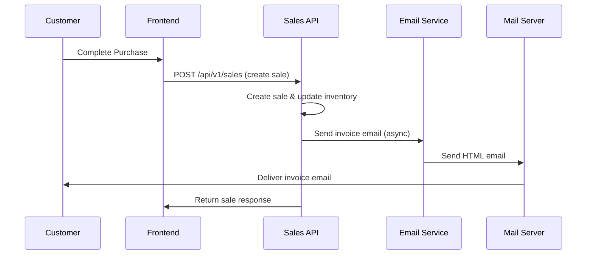
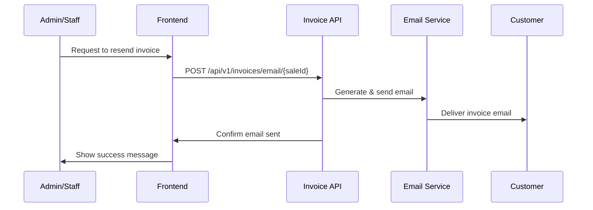

# 📧 Invoice Email System Documentation

## Overview

The Invoice Email System automatically sends professional invoice emails to customers after completing a sale. The system includes beautiful HTML templates, automatic email sending, manual resend options, and reminder functionality.

## 🚀 Features

### Automatic Email Sending

- ✅ **Automatic Trigger**: Emails sent immediately after sale completion
- ✅ **Professional Templates**: Beautiful HTML email templates
- ✅ **Fallback Text**: Plain text version for all email clients
- ✅ **Error Handling**: Graceful handling of email failures
- ✅ **Logging**: Comprehensive logging for debugging

### Manual Email Management

- ✅ **Resend Invoices**: Manually resend invoice emails
- ✅ **Reminder Emails**: Send payment or follow-up reminders
- ✅ **Email Status**: Check if customer has email address
- ✅ **Bulk Operations**: Send emails to multiple customers

### Email Templates

- ✅ **Responsive Design**: Mobile-friendly email templates
- ✅ **Professional Styling**: Modern, clean design
- ✅ **Brand Consistency**: Customizable shop branding
- ✅ **Multiple Types**: Invoice, reminder, and follow-up templates

## 📋 How It Works

### 1. Automatic Email Flow



### 2. Manual Email Management



## 🔧 Implementation Details

### Sales Controller Integration

When a sale is created, the system automatically:

1. **Creates the sale** with all items and inventory updates
2. **Generates invoice number** and calculates totals
3. **Triggers email sending** (asynchronously, doesn't block response)
4. **Logs email status** for monitoring
5. **Returns sale response** with email status indicator

```typescript
// In createSale controller
if (sale.customer.email) {
  invoiceEmailService
    .sendInvoiceEmail(sale.id)
    .then((emailSent) => {
      if (emailSent) {
        logger.info(
          `Invoice email sent successfully to ${sale.customer.email}`
        );
      }
    })
    .catch((error) => {
      logger.error(`Error sending invoice email:`, error);
    });
}
```

### Email Service Architecture

The `invoiceEmailService` provides:

- **sendInvoiceEmail()**: Send complete invoice with items and totals
- **sendInvoiceReminder()**: Send payment or follow-up reminders
- **generateInvoiceHTML()**: Create beautiful HTML email content
- **generateTextContent()**: Create plain text fallback

## 📧 Email Templates

### Invoice Email Template

The invoice email includes:

- **Professional Header**: Shop name and branding
- **Customer Greeting**: Personalized message
- **Invoice Details**: Number, date, payment method
- **Items Table**: Products, quantities, prices
- **Total Summary**: Subtotal, discounts, final amount
- **Footer**: Contact information and legal text

### Reminder Email Templates

Two types of reminders:

1. **Payment Reminder**: For pending payments
2. **Follow-up**: Thank you and satisfaction check

## 🛠️ API Endpoints

### Automatic Email (Built into Sales)

```http
POST /api/v1/sales
Content-Type: application/json
Authorization: Bearer {token}

{
  "shopId": "shop-uuid",
  "customerId": "customer-uuid",
  "items": [
    {
      "productId": "product-uuid",
      "quantity": 2,
      "unitPrice": 500.00
    }
  ],
  "paymentMode": "CASH"
}
```

**Response includes email status:**

```json
{
  "success": true,
  "message": "Sale created successfully and invoice generated",
  "data": {
    "id": "sale-uuid",
    "invoiceNo": "INV-2024-001",
    "totalAmount": 1000.0,
    "emailSent": true,
    "invoiceDetails": {
      "invoiceUrl": "/api/v1/invoices/print/sale-uuid"
    }
  }
}
```

### Manual Email Management

#### Send Invoice Email

```http
POST /api/v1/invoices/email/{saleId}
Authorization: Bearer {token}
```

#### Resend Invoice Email

```http
POST /api/v1/invoices/email/{saleId}/resend
Authorization: Bearer {token}
```

#### Send Reminder Email

```http
POST /api/v1/invoices/email/{saleId}/reminder
Content-Type: application/json
Authorization: Bearer {token}

{
  "type": "payment" // or "followup"
}
```

#### Check Email Status

```http
GET /api/v1/invoices/email/{saleId}/status
Authorization: Bearer {token}
```

**Response:**

```json
{
  "success": true,
  "data": {
    "saleId": "sale-uuid",
    "customerName": "John Doe",
    "customerEmail": "john@example.com",
    "hasEmail": true,
    "canSendEmail": true,
    "invoiceNo": "INV-2024-001"
  }
}
```

## 🎨 Frontend Integration

### Automatic Email Notification

```javascript
// After creating a sale
const createSale = async (saleData) => {
  const response = await fetch("/api/v1/sales", {
    method: "POST",
    headers: {
      "Content-Type": "application/json",
      Authorization: `Bearer ${token}`,
    },
    body: JSON.stringify(saleData),
  });

  const result = await response.json();

  if (result.success) {
    // Show success message with email status
    if (result.data.emailSent) {
      showNotification(
        "Sale completed! Invoice email sent to customer.",
        "success"
      );
    } else {
      showNotification(
        "Sale completed! Customer has no email address.",
        "warning"
      );
    }
  }
};
```

### Manual Email Management

```javascript
// Resend invoice email
const resendInvoiceEmail = async (saleId) => {
  try {
    const response = await fetch(`/api/v1/invoices/email/${saleId}/resend`, {
      method: "POST",
      headers: { Authorization: `Bearer ${token}` },
    });

    const result = await response.json();

    if (result.success) {
      showNotification(
        `Invoice email sent to ${result.data.customerEmail}`,
        "success"
      );
    }
  } catch (error) {
    showNotification("Failed to send email", "error");
  }
};

// Send reminder email
const sendReminder = async (saleId, type = "followup") => {
  try {
    const response = await fetch(`/api/v1/invoices/email/${saleId}/reminder`, {
      method: "POST",
      headers: {
        "Content-Type": "application/json",
        Authorization: `Bearer ${token}`,
      },
      body: JSON.stringify({ type }),
    });

    const result = await response.json();

    if (result.success) {
      showNotification(`${type} reminder sent successfully`, "success");
    }
  } catch (error) {
    showNotification("Failed to send reminder", "error");
  }
};
```

### Sales Dashboard with Email Actions

```jsx
const SalesRow = ({ sale }) => {
  const [emailStatus, setEmailStatus] = useState(null);

  useEffect(() => {
    // Check email status
    fetch(`/api/v1/invoices/email/${sale.id}/status`)
      .then((res) => res.json())
      .then((data) => setEmailStatus(data.data));
  }, [sale.id]);

  return (
    <tr>
      <td>{sale.invoiceNo}</td>
      <td>{sale.customer.name}</td>
      <td>₹{sale.totalAmount}</td>
      <td>
        {emailStatus?.hasEmail ? (
          <div className="email-actions">
            <button
              onClick={() => resendInvoiceEmail(sale.id)}
              className="btn btn-sm btn-primary"
            >
              📧 Resend Invoice
            </button>
            <button
              onClick={() => sendReminder(sale.id, "followup")}
              className="btn btn-sm btn-secondary"
            >
              🔔 Send Reminder
            </button>
          </div>
        ) : (
          <span className="text-muted">No email address</span>
        )}
      </td>
    </tr>
  );
};
```

## ⚙️ Configuration

### Email Settings

Update your `.env` file:

```env
# Email Configuration
MAIL_HOST=smtp.gmail.com
MAIL_PORT=587
MAIL_USER=your-business-email@gmail.com
MAIL_PASS=your-app-password
MAIL_SECURE=false
```

### Gmail Setup

1. **Enable 2-Factor Authentication** on your Gmail account
2. **Generate App Password**:
   - Go to Google Account settings
   - Security → 2-Step Verification → App passwords
   - Generate password for "Mail"
3. **Use App Password** in `MAIL_PASS` environment variable

### Custom SMTP

For custom SMTP servers:

```env
MAIL_HOST=mail.yourdomain.com
MAIL_PORT=587
MAIL_USER=noreply@yourdomain.com
MAIL_PASS=your-smtp-password
MAIL_SECURE=true
```

## 🔍 Monitoring & Logging

### Email Logs

The system logs all email activities:

```typescript
// Success logs
logger.info(
  `Invoice email sent successfully to ${customerEmail} for sale ${saleId}`
);

// Warning logs
logger.warn(
  `Customer ${customerName} has no email address. Invoice not sent for sale ${saleId}`
);

// Error logs
logger.error(`Failed to send invoice email for sale ${saleId}:`, error);
```

### Monitoring Dashboard

Track email metrics:

- **Total emails sent**
- **Success rate**
- **Failed deliveries**
- **Customer engagement**

## 🚨 Error Handling

### Common Issues & Solutions

#### 1. Email Not Sending

```
Error: Authentication failed
```

**Solution**: Check email credentials and app password

#### 2. Customer Has No Email

```
Warning: Customer has no email address
```

**Solution**: Update customer record with email address

#### 3. SMTP Connection Failed

```
Error: Connection timeout
```

**Solution**: Check SMTP settings and firewall rules

### Graceful Degradation

The system handles email failures gracefully:

1. **Sale Still Completes**: Email failure doesn't block sale creation
2. **Manual Retry**: Staff can manually resend emails
3. **Alternative Methods**: Print invoice or send via other channels
4. **Customer Notification**: Frontend shows email status

## 📱 Mobile Considerations

### Responsive Email Templates

The email templates are mobile-optimized:

- **Responsive Design**: Adapts to screen size
- **Touch-Friendly**: Large buttons and links
- **Fast Loading**: Optimized images and CSS
- **Accessibility**: Screen reader compatible

### Mobile App Integration

For mobile apps:

```javascript
// React Native example
const handleSaleComplete = (saleResult) => {
  if (saleResult.emailSent) {
    Alert.alert(
      "Sale Complete",
      "Invoice email sent to customer successfully!",
      [{ text: "OK" }]
    );
  } else {
    Alert.alert(
      "Sale Complete",
      "Sale completed but customer has no email address.",
      [
        { text: "OK" },
        {
          text: "Add Email",
          onPress: () => editCustomer(saleResult.customerId),
        },
      ]
    );
  }
};
```

## 🔮 Future Enhancements

### Planned Features

1. **Email Templates Editor**: Visual template customization
2. **Bulk Email Operations**: Send emails to multiple customers
3. **Email Analytics**: Open rates, click tracking
4. **SMS Integration**: Send invoice via SMS as backup
5. **WhatsApp Integration**: Send invoices via WhatsApp Business
6. **Email Scheduling**: Schedule reminder emails
7. **Customer Preferences**: Let customers choose email frequency
8. **Multi-language Support**: Emails in customer's preferred language

### Advanced Features

1. **Email Campaigns**: Marketing emails to customers
2. **Automated Follow-ups**: Sequence of reminder emails
3. **Customer Feedback**: Request reviews via email
4. **Loyalty Programs**: Email-based loyalty rewards
5. **Inventory Alerts**: Notify customers of restocked items

This email system provides a complete solution for automatic invoice delivery, ensuring customers receive professional invoices immediately after purchase while providing staff with tools to manage email communications effectively.
