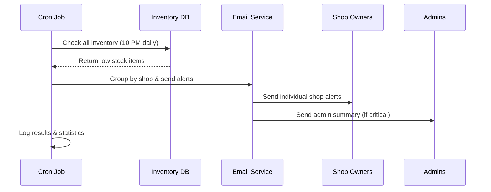
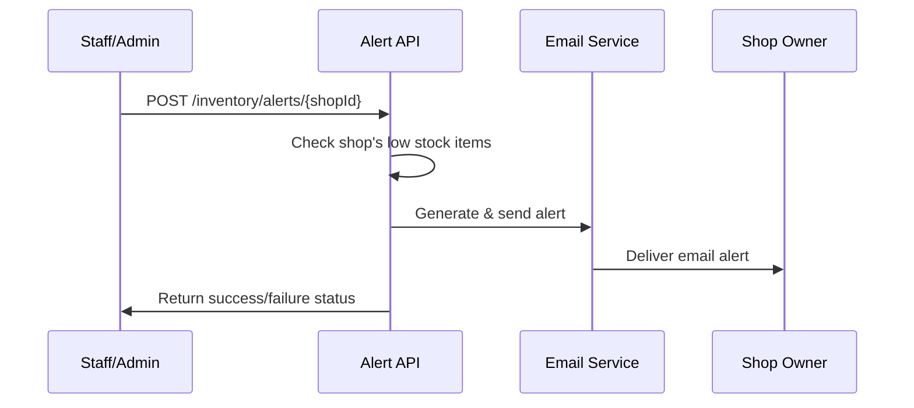

# 📦 Low Stock Alert System Documentation

## Overview

The Low Stock Alert System automatically monitors inventory levels across all shops and sends email notifications to shop owners when stock levels fall below defined thresholds. The system includes automated nightly checks, manual alerts, and comprehensive reporting.

## 🚀 Features

### Automated Monitoring

- ✅ **Nightly Cron Job**: Runs at 10 PM daily to check all inventory
- ✅ **Configurable Thresholds**: Customizable low stock levels
- ✅ **Multi-Shop Support**: Monitors all shops independently
- ✅ **Smart Grouping**: Groups alerts by shop owner

### Email Notifications

- ✅ **Professional Templates**: Beautiful HTML email alerts
- ✅ **Urgency Levels**: Critical, Low, and Warning classifications
- ✅ **Detailed Reports**: Complete item lists with status
- ✅ **Admin Summaries**: Daily system-wide reports for administrators

### Manual Management

- ✅ **Manual Triggers**: Send alerts on-demand
- ✅ **Individual Shop Alerts**: Target specific shops
- ✅ **Bulk Operations**: Send alerts to all affected shops
- ✅ **Testing Tools**: Test email configuration and templates

## 📋 How It Works

### 1. Automated Nightly Check Flow



### 2. Manual Alert Flow



## 🔧 Configuration

### Environment Variables

```env
# Low Stock Alert Configuration
LOW_STOCK_ALERTS_ENABLED=true
LOW_STOCK_THRESHOLD=10
TIMEZONE=Asia/Kolkata

# Email Configuration (required)
MAIL_HOST=smtp.gmail.com
MAIL_PORT=587
MAIL_USER=your-business-email@gmail.com
MAIL_PASS=your-app-password
```

### Stock Thresholds

- **Default Threshold**: 10 items (configurable)
- **Critical Level**: ≤ 2 items (out of stock or nearly out)
- **Low Level**: 3-5 items (needs restocking soon)
- **Warning Level**: 6-10 items (monitor closely)

## 📧 Email Templates

### Shop Owner Alert Email

The shop owner receives a comprehensive email including:

- **Urgency Banner**: Critical/Warning status
- **Shop Information**: Name, location, owner details
- **Summary Statistics**: Total items, critical count, low count
- **Detailed Item List**: Product names, categories, current stock, status
- **Action Recommendations**: Specific steps to take
- **Professional Branding**: Shop-specific customization

### Admin Summary Email

Administrators receive daily summaries with:

- **System-wide Statistics**: Total low stock items across all shops
- **Email Delivery Report**: Success/failure rates
- **Critical Alerts**: Shops with out-of-stock items
- **Recommendations**: System-level actions needed

## 🛠️ API Endpoints

### Manual Alert Management

#### Send Alert to Specific Shop

```http
POST /api/v1/inventory/alerts/{shopId}
Authorization: Bearer {token}
Content-Type: application/json

{
  "threshold": 10
}
```

**Response:**

```json
{
  "success": true,
  "message": "Low stock alert sent successfully",
  "data": {
    "shopId": "shop-uuid",
    "shopName": "Downtown Furniture",
    "ownerEmail": "owner@example.com",
    "lowStockItems": 5,
    "criticalItems": 2,
    "emailSent": true
  }
}
```

#### Send Alerts to All Shops

```http
POST /api/v1/inventory/alerts/send-all
Authorization: Bearer {token}
Content-Type: application/json

{
  "threshold": 10
}
```

**Response:**

```json
{
  "success": true,
  "message": "Low stock alerts processing completed",
  "data": {
    "totalShops": 8,
    "emailsSent": 6,
    "emailsFailed": 0,
    "shopsWithoutEmail": 2,
    "threshold": 10,
    "timestamp": "2024-01-15T22:00:00.000Z"
  }
}
```

#### Get Low Stock Summary

```http
GET /api/v1/inventory/alerts/summary?threshold=10
Authorization: Bearer {token}
```

**Response:**

```json
{
  "success": true,
  "data": {
    "summary": {
      "totalShops": 8,
      "totalLowStockItems": 25,
      "totalCriticalItems": 8,
      "shopsWithoutEmail": 2,
      "threshold": 10,
      "lastChecked": "2024-01-15T22:00:00.000Z"
    },
    "shops": [
      {
        "shopId": "shop-1",
        "shopName": "Downtown Furniture",
        "shopLocation": "123 Main St",
        "ownerName": "John Doe",
        "ownerEmail": "john@example.com",
        "hasEmail": true,
        "totalItems": 5,
        "criticalItems": 2,
        "lowItems": 3
      }
    ]
  }
}
```

#### Get Detailed Low Stock Items

```http
GET /api/v1/inventory/alerts/detailed?shopId=shop-uuid&threshold=10&page=1&limit=20
Authorization: Bearer {token}
```

**Response:**

```json
{
  "success": true,
  "data": {
    "items": [
      {
        "id": "inv-uuid",
        "productId": "prod-uuid",
        "shopId": "shop-uuid",
        "quantity": 0,
        "status": "Out of Stock",
        "urgencyLevel": "critical",
        "needsRestock": true,
        "product": {
          "name": "Modern Sofa",
          "price": "899.99",
          "category": { "name": "Living Room" }
        },
        "shop": {
          "name": "Downtown Furniture",
          "location": "123 Main St"
        },
        "warehouse": { "name": "Main Warehouse" }
      }
    ],
    "meta": {
      "currentPage": 1,
      "totalPages": 2,
      "totalItems": 25,
      "itemsPerPage": 20
    },
    "summary": {
      "totalItems": 25,
      "outOfStock": 8,
      "critical": 5,
      "low": 12,
      "threshold": 10
    }
  }
}
```

### Admin Management

#### Trigger Manual Check

```http
POST /api/v1/inventory/alerts/trigger-check
Authorization: Bearer {admin-token}
```

#### Test Low Stock Alert

```http
POST /api/v1/admin/test-low-stock-alert
Authorization: Bearer {admin-token}
Content-Type: application/json

{
  "testEmail": "test@example.com",
  "shopId": "optional-shop-id"
}
```

## 🎨 Frontend Integration

### Dashboard Widget

```jsx
const LowStockWidget = () => {
  const [summary, setSummary] = useState(null);
  const [loading, setLoading] = useState(true);

  useEffect(() => {
    fetchLowStockSummary();
  }, []);

  const fetchLowStockSummary = async () => {
    try {
      const response = await fetch("/api/v1/inventory/alerts/summary");
      const data = await response.json();
      setSummary(data.data.summary);
    } catch (error) {
      console.error("Error fetching low stock summary:", error);
    } finally {
      setLoading(false);
    }
  };

  const sendAllAlerts = async () => {
    try {
      const response = await fetch("/api/v1/inventory/alerts/send-all", {
        method: "POST",
        headers: { "Content-Type": "application/json" },
        body: JSON.stringify({ threshold: 10 }),
      });

      const result = await response.json();

      if (result.success) {
        alert(`Alerts sent to ${result.data.emailsSent} shops`);
      }
    } catch (error) {
      alert("Failed to send alerts");
    }
  };

  if (loading) return <div>Loading...</div>;

  return (
    <div className="low-stock-widget">
      <h3>📦 Low Stock Alert</h3>

      <div className="stats">
        <div className="stat-item">
          <span className="label">Total Low Stock:</span>
          <span className="value">{summary.totalLowStockItems}</span>
        </div>
        <div className="stat-item critical">
          <span className="label">Critical Items:</span>
          <span className="value">{summary.totalCriticalItems}</span>
        </div>
        <div className="stat-item">
          <span className="label">Shops Affected:</span>
          <span className="value">{summary.totalShops}</span>
        </div>
      </div>

      <div className="actions">
        <button onClick={sendAllAlerts} className="btn btn-warning">
          📧 Send All Alerts
        </button>
        <button onClick={() => (window.location.href = "/inventory/low-stock")}>
          📊 View Details
        </button>
      </div>
    </div>
  );
};
```

### Shop-Specific Alert Management

```jsx
const ShopAlertManager = ({ shopId }) => {
  const [alertStatus, setAlertStatus] = useState(null);

  const sendShopAlert = async () => {
    try {
      const response = await fetch(`/api/v1/inventory/alerts/${shopId}`, {
        method: "POST",
        headers: { "Content-Type": "application/json" },
        body: JSON.stringify({ threshold: 10 }),
      });

      const result = await response.json();
      setAlertStatus(result);

      if (result.success && result.data.emailSent) {
        alert(`Alert sent to ${result.data.ownerEmail}`);
      } else if (!result.data.ownerEmail) {
        alert("Shop owner has no email address configured");
      }
    } catch (error) {
      alert("Failed to send alert");
    }
  };

  return (
    <div className="shop-alert-manager">
      <button onClick={sendShopAlert} className="btn btn-primary">
        📧 Send Low Stock Alert
      </button>

      {alertStatus && (
        <div className={`alert ${alertStatus.success ? "success" : "error"}`}>
          {alertStatus.message}
        </div>
      )}
    </div>
  );
};
```

## 📊 Monitoring & Analytics

### Cron Job Logs

The system logs all cron job activities:

```
[2024-01-15 22:00:00] INFO: Starting nightly low stock check...
[2024-01-15 22:00:01] INFO: Found 25 low stock items across 8 shops
[2024-01-15 22:00:05] INFO: Low stock check completed in 5234ms: {
  "totalShops": 8,
  "emailsSent": 6,
  "emailsFailed": 0,
  "shopsWithoutEmail": 2,
  "totalLowStockItems": 25,
  "criticalItems": 8,
  "duration": "5234ms"
}
```

### Email Delivery Tracking

- **Success Rate**: Track successful email deliveries
- **Failure Analysis**: Log and analyze email failures
- **Shop Coverage**: Monitor shops without email addresses
- **Response Tracking**: Future enhancement for email opens/clicks

## 🔧 Customization

### Adjusting Thresholds

You can customize thresholds per shop or globally:

```javascript
// Global threshold adjustment
const updateGlobalThreshold = async (newThreshold) => {
  // Update environment variable or database setting
  process.env.LOW_STOCK_THRESHOLD = newThreshold.toString();
};

// Shop-specific threshold (future enhancement)
const updateShopThreshold = async (shopId, threshold) => {
  // Store in shop settings table
  await prisma.shopSettings.upsert({
    where: { shopId },
    update: { lowStockThreshold: threshold },
    create: { shopId, lowStockThreshold: threshold },
  });
};
```

### Custom Email Templates

Modify the email templates in `lowStockEmailService.ts`:

```javascript
// Add custom branding
const customHeader = createEmailHeader(
  `🚨 ${shopAlert.shopName} - Stock Alert`,
  `Urgent: ${shopAlert.criticalItems} items need immediate attention`
);

// Add custom footer with shop-specific contact info
const customFooter = createEmailFooter(
  shopAlert.shopName,
  shopAlert.shopLocation,
  `Contact support: ${shopAlert.supportEmail || "support@yourcompany.com"}`
);
```

## 🚨 Troubleshooting

### Common Issues

#### 1. Emails Not Sending

```
Error: Authentication failed
```

**Solution**: Check email credentials and app password

#### 2. Cron Job Not Running

```
Warning: Low stock alerts are disabled
```

**Solution**: Set `LOW_STOCK_ALERTS_ENABLED=true` in environment

#### 3. Shop Owner Not Receiving Alerts

```
Warning: Shop owner has no email address
```

**Solution**: Update shop owner's email in user profile

#### 4. High Memory Usage

```
Error: JavaScript heap out of memory
```

**Solution**: Process shops in batches for large systems

### Performance Optimization

For large systems with many shops:

```javascript
// Process shops in batches
const BATCH_SIZE = 10;
const shopAlerts = await lowStockEmailService.getLowStockItemsByShop(threshold);

for (let i = 0; i < shopAlerts.length; i += BATCH_SIZE) {
  const batch = shopAlerts.slice(i, i + BATCH_SIZE);
  await Promise.all(
    batch.map((alert) => lowStockEmailService.sendLowStockAlert(alert))
  );

  // Small delay between batches to avoid overwhelming email server
  await new Promise((resolve) => setTimeout(resolve, 1000));
}
```

## 🔮 Future Enhancements

### Planned Features

1. **SMS Alerts**: Send SMS notifications for critical items
2. **WhatsApp Integration**: Send alerts via WhatsApp Business
3. **Push Notifications**: Real-time browser/mobile notifications
4. **Predictive Analytics**: AI-powered stock level predictions
5. **Automatic Reordering**: Integration with supplier systems
6. **Custom Schedules**: Per-shop alert timing preferences
7. **Escalation Rules**: Multiple reminder levels
8. **Mobile App**: Dedicated mobile app for shop owners

### Advanced Analytics

1. **Stock Trend Analysis**: Historical low stock patterns
2. **Seasonal Adjustments**: Automatic threshold adjustments
3. **Supplier Performance**: Track restock response times
4. **Cost Impact**: Calculate lost sales from stock-outs
5. **Optimization Suggestions**: AI-powered inventory recommendations

This low stock alert system provides comprehensive inventory monitoring with professional email notifications, ensuring shop owners never miss critical stock situations while providing administrators with complete oversight and control.
